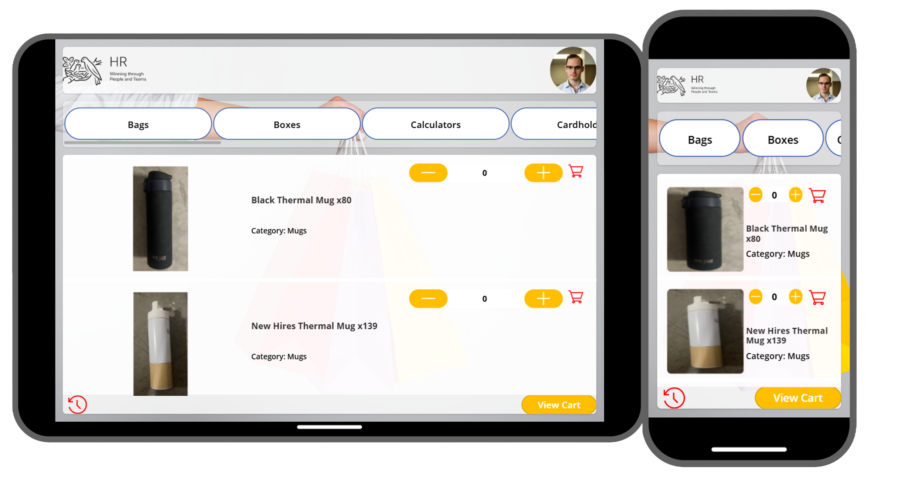
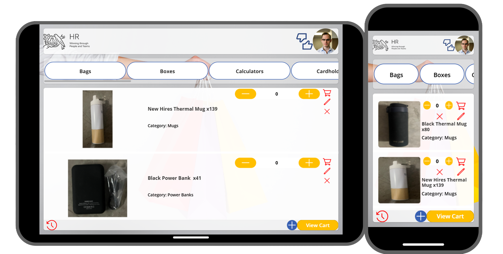

# HR Inventory Manager (Power Platform)

A fully integrated **HR Inventory Management System** built using **Microsoft Power Apps, Power Automate, and SharePoint**.

The system digitizes the internal giveaway ordering process, enforces real-time inventory control, and automates the full lifecycle of requests — transforming an informal, manual workflow into a structured, scalable, and traceable system.

---

## Application Experience

  
  

<em>Standard user interface and admin interface with extended operational controls</em>

Users interact with inventory in real time, submit requests seamlessly, and admins manage the full lifecycle through a unified application.

---

## System Overview

The HR Inventory Manager handles the complete lifecycle of giveaway requests:

1. Employees browse available inventory  
2. Employees select items and adjust quantities  
3. Requests are submitted through the application  
4. Notifications are automatically triggered  
5. Admins or stock keepers process requests  
6. Requests are marked as Delivered or Cancelled  
7. Delivered requests are archived for long-term tracking  

The system is designed as a **single unified application with role-based behavior**, rather than separate apps.

---

## System Architecture

The system follows a layered architecture:

### Users
- Employees  
- Admins  
- Stock Keepers  

### Application Layer
- Power Apps Canvas Application (responsive UI)

### Automation Layer
- Power Automate workflows for lifecycle orchestration

### Data Layer
- SharePoint Lists for persistent storage

Detailed architecture:  
`docs/architecture.md`

---

## Core Features

### 1. Inventory Exploration
- category-based filtering  
- visual inventory gallery  
- intuitive item selection  
- real-time interaction  

---

### 2. Request Submission
- inline quantity adjustment  
- cart-based confirmation flow  
- validation against available stock  
- seamless submission experience  

---

### 3. Admin Control Layer
- view incoming requests  
- update request status  
- manage delivery lifecycle  
- maintain operational oversight  

---

### 4. Automated Request Lifecycle
- request submission notifications  
- cancellation communication  
- delivery-based lifecycle transitions  
- automatic archiving of completed requests  

---

### 5. Fully Responsive Experience
- desktop  
- tablet  
- mobile  

The UI adapts dynamically to ensure consistent usability across all devices.

---

## Request Lifecycle Model

| Status | Description |
|------|------------|
| Pending | Request submitted and awaiting processing |
| Delivered | Request fulfilled and completed |
| Cancelled | Request terminated before fulfillment |

State transitions trigger automation and data movement across the system.

---

## SharePoint Backend

The system uses SharePoint as the primary data store.

### Lists Used

| List | Purpose |
|-----|--------|
| `Gift_Stocks` | Inventory source of giveaway items |
| `Giveaway_Requests` | Active request tracking |
| `Admins` | Role-based access control |
| `Stock_Keepers` | Operational stakeholders |
| `Delivered_Items` | Archived delivery records |

Full schema:  
`sharepoint/schema.md`

---

## Automation Workflows

The system uses **event-driven automation** through Power Automate.

### Key Workflows
- Request notification flow  
- Cancellation handling  
- Delivery-triggered archiving  

Detailed documentation:  
`powerautomate/README.md`

---

## Power Apps Application

The frontend is built as a **Canvas App** with:

- responsive layouts  
- role-based UI logic  
- inline interaction patterns  
- real-time SharePoint integration  

Details:  
`powerapps/README.md`

---

## Design Philosophy

This system is built around:

- **event-driven architecture**  
- **separation of concerns**  
- **scalability through data archiving**  
- **low-code, high-impact design**  
- **configuration-driven access control**  

Detailed decisions:  
`docs/design-decisions.md`

---

## Repository Structure

hr-inventory-manager/
│
├── powerapps/
│ ├── exports/
│ │ └── hr-inventory-manager.msapp
│ └── screenshots/
│ ├── normal-view.png
│ └── admin-view.png
│
├── powerautomate/
│ └── README.md
│
├── sharepoint/
│ └── schema.md
│
├── docs/
│ ├── architecture.md
│ ├── process-flow.md
│ └── design-decisions.md
│
├── README.md
├── LICENSE
└── .gitignore

---

## Technology Stack

- Microsoft Power Apps  
- Microsoft Power Automate  
- SharePoint Online  
- Microsoft 365  

---

## Security and Privacy

This repository contains:

- application structure  
- schema documentation  
- sanitized screenshots  

No confidential or proprietary data is included.

---

## Deployment

The system can be deployed in any Microsoft 365 environment:

1. Create SharePoint lists  
2. Import Power Apps application  
3. Configure data connections  
4. Deploy Power Automate workflows  
5. Populate role-based lists  

---

## Why This Project Matters

This project demonstrates how the Microsoft Power Platform can be used to build a complete internal business system with:

- real-world workflow transformation  
- system design thinking  
- scalable data modeling  
- automated lifecycle management  
- role-based application architecture  

---

## License

MIT License — see `LICENSE`.

---

## Author

Developed as part of a real-world HR workflow automation initiative using the Microsoft Power Platform.